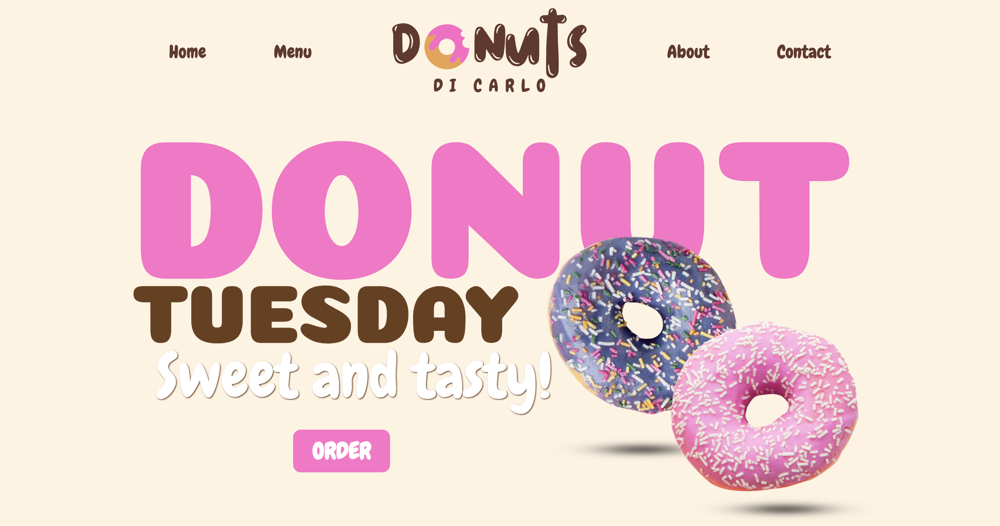
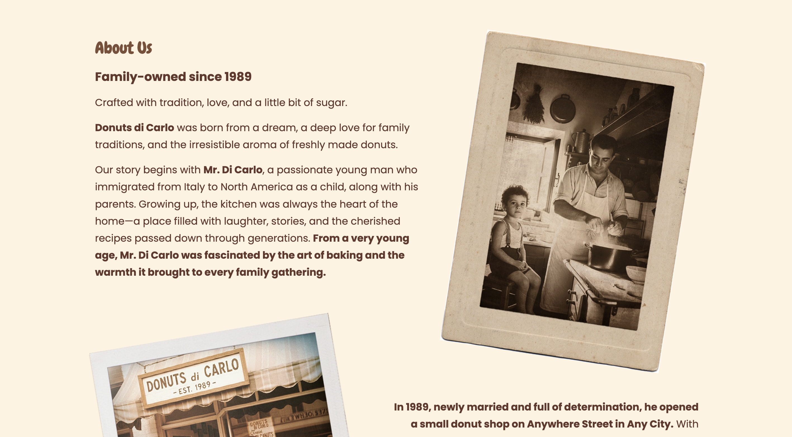
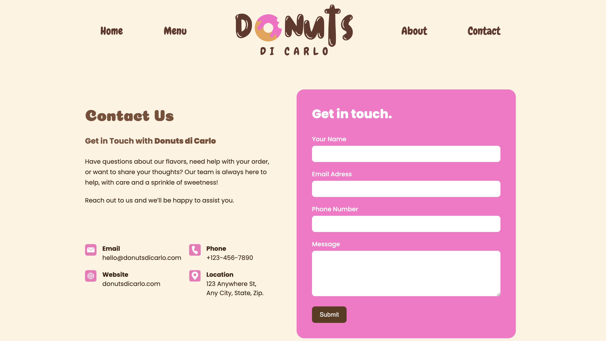
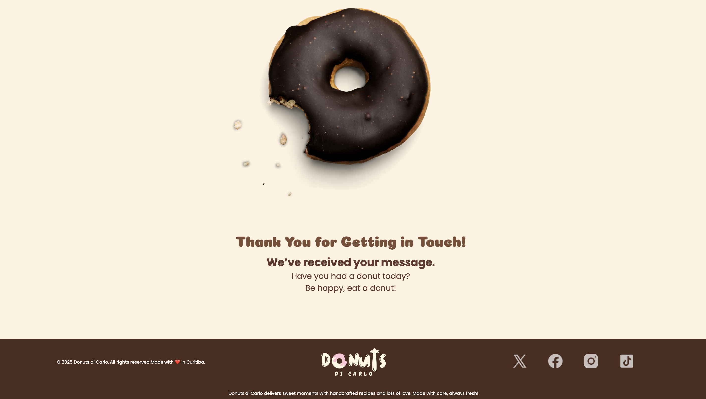

# 🍩 Donuts Di Carlo – Website

[](#)
[](#)
[](#)
[](#)

**Donuts Di Carlo** is a fictional website project created for study purposes.  
It simulates a donut shop’s online presence featuring a menu, an about page, and a contact form.  
The main goal was to practice **HTML**, **CSS**, and basic **JavaScript** skills.

---

## 📌 Project Overview

This project was developed to practice building a multi-page static website.  
It contains a home page, product menu, company information, and a contact form.  
The layout was designed to be clean, intuitive, and easy to navigate.

---

## 🧩 Main Sections

- ✅ Home Page (introduction and highlights)  
- ✅ Menu Page (products with images and prices)  
- ✅ About Page (history and brand information)  
- ✅ Contact Page (form and action page)  
- ✅ Footer (basic links and info)  

---

## 🛠️ Technologies Used

- **HTML5** – page structure  
- **CSS3** – styling and layout  
- **JavaScript** – simple interactions and events  

---

## 🎯 Purpose & Learning Goals

- Practice multi-page static website development  
- Improve skills in structuring HTML and CSS  
- Gain experience creating a simple UI/UX flow  
- Prepare for larger front-end projects  

---

## 🚀 Getting Started

1. Clone the repository:

   ```bash
   git clone https://github.com/OJhonnys/Donuts-Di-Carlo.git

2. Open the project folder and run index.html in your browser.
(Tip: use VSCode with the Live Server extension for a smoother dev experience.)

## 📸 Screenshots

Here are some previews of the landing page layout:


> 

> 

> 

> 

---

## ⚠️ Disclaimer

This project is purely for educational purposes.  
**Donuts Di Carlo** is a fictional brand created to improve front-end development skills.

---

## 👨‍💻 Author

Made with ❤️ by **Jhonny Da Silva** – a front-end developer passionate about clean UI and practical learning.

[](https://www.linkedin.com/in/jhonnydasilva/)
[](https://github.com/OJhonnys)

